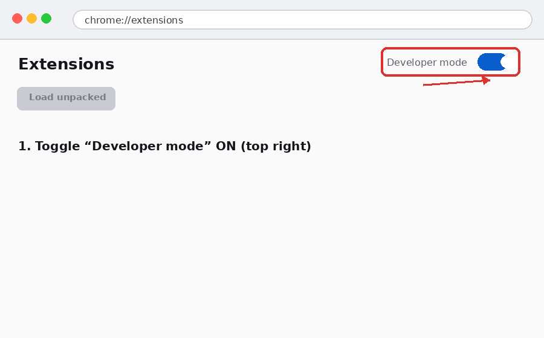
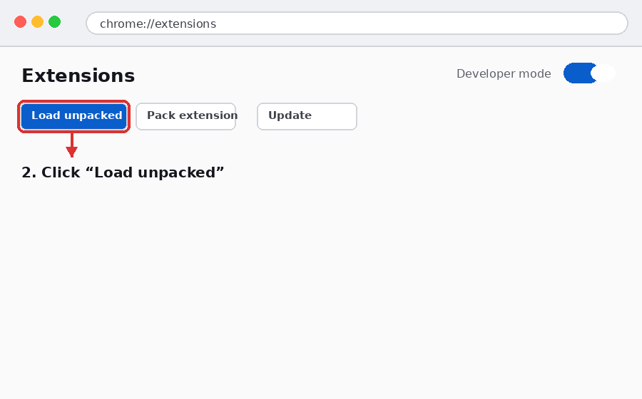
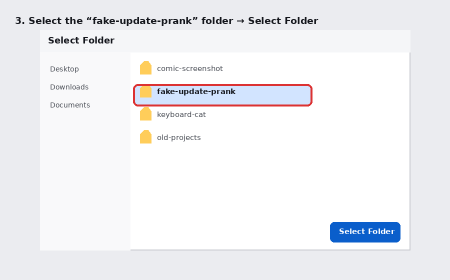
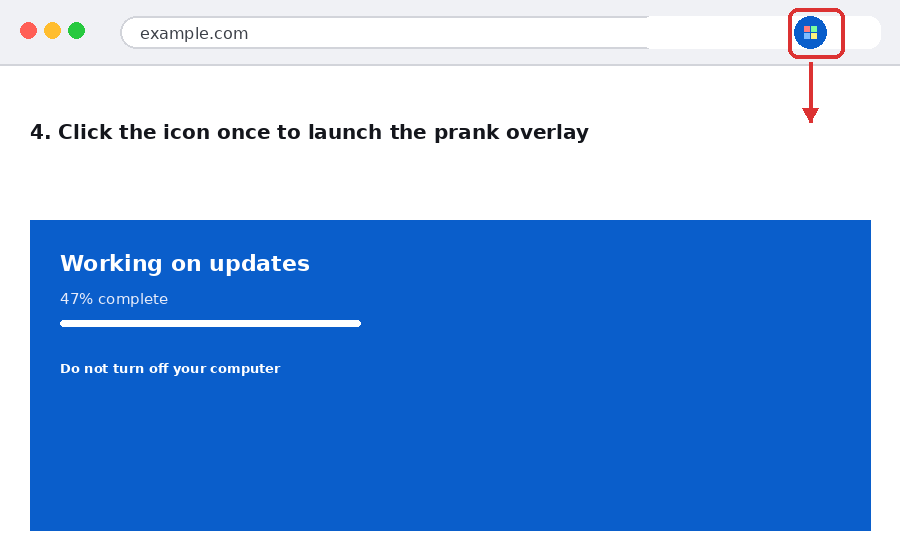
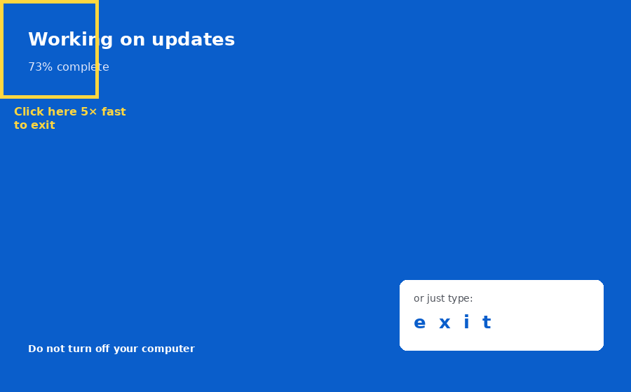

# 🖥️ Fake Update Prank

A Chrome extension that overlays a realistic-looking full-screen "System Update" screen on the current tab — complete with a creeping progress bar and "Do not turn off your computer." Perfect for a harmless prank on a friend's laptop.


---

## What it does

- Click the toolbar icon → instantly overlays a fake system update screen on the current tab
- Progress bar creeps up unevenly, stalls, and never quite finishes — just like the real thing
- Two secret ways to exit, so you're never actually stuck
- No permissions beyond the current tab — it can't read your data, browsing history, or anything else

---

## How to install it (Chrome)

Since this isn't on the Chrome Web Store, you load it manually in **Developer mode**. Four steps:


### Step 1 — Open Extensions and turn on Developer mode

Go to `chrome://extensions` in your address bar, then toggle **Developer mode** on in the top-right corner.




### Step 2 — Click "Load unpacked"

Once Developer mode is on, three new buttons appear. Click **Load unpacked**.




### Step 3 — Select the `fake-update-prank` folder

A folder picker opens. Navigate to wherever you unzipped this project, select the **fake-update-prank** folder itself (not a file inside it), then click **Select Folder**.




### Step 4 — Trigger the prank

The icon appears in your toolbar. Click it once on any tab — the fake update screen takes over immediately.



---


## How to exit the prank

There's no visible close button on purpose — that's the joke. Two secret ways out:



| Method | How |
|---|---|
| **Type "exit"** | Just start typing the word `exit` anywhere — no need to click into a text box first |
| **Corner clicks** | Click the top-left corner of the screen 5 times within 3 seconds |

---

## How to use it

| Action | Result |
|---|---|
| Click the toolbar icon | Overlays the fake update screen on the current tab |
| Type `exit` | Closes the overlay |
| Click top-left corner ×5 fast | Closes the overlay |
| Switch tabs / close tab | Prank only affects the tab it was triggered on |

**Note:** if a tab was already open *before* you installed the extension, refresh that tab once before triggering the prank — Chrome only injects extensions into tabs loaded after installation.

---


IF YOU NEED TO CHANGE
## Troubleshooting

**Clicking the icon does nothing:**
- Refresh the tab first (see note above)
- Won't work on `chrome://` pages, the Chrome Web Store, or the extensions page — Chrome blocks extensions there by design

**Can't exit the overlay:**
- Make sure you're typing `exit` with a US keyboard layout and no modifier keys held
- The corner-click method needs all 5 clicks within 3 seconds — if it resets, just try again
- As a last resort, you can always reload the tab (Ctrl+R / Cmd+R) — the prank doesn't survive a refresh

**Extension won't load / "Load unpacked" gives an error:**
- Make sure you selected the `fake-update-prank` folder itself, not a parent folder or a file inside it
- Confirm the folder contains `manifest.json`, `background.js`, `prank.js`, `prank.css`, and the `icons` folder

---

## Files in this project

```
fake-update-prank/
├── manifest.json     
├── background.js     
├── prank.js           
├── prank.css          
├── icons/              
└── images/            
```

---


