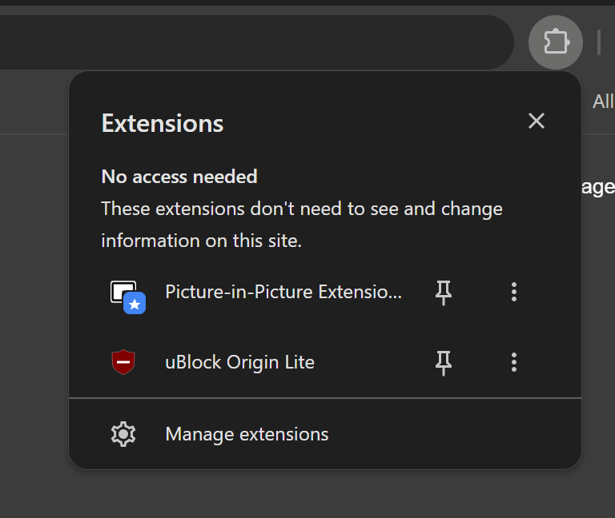
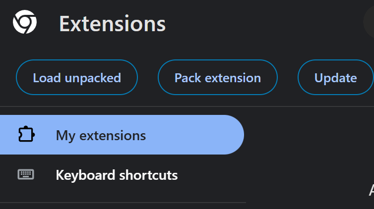
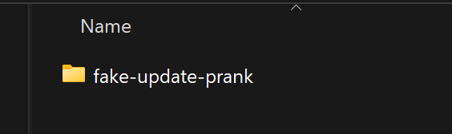

## 📁 Project Structure

```
Fake-update-screen/

├── manifest.json    
├── background.js      
├── prank.js         
├── prank.css   
└── attached_assets/
|        ├── image1.png
|        ├── image2.png
|        └── image3.png
|        └── image4.png
|        └── image5.png
└── icons/
        ├── icon16.png
        ├── icon48.png
        └── icon128.png
```

---

## 🔧 Installation Guide (Chrome — Developer Mode)

Since this extension is not yet published on the Chrome Web Store, you can install it manually in a few easy steps.

---

### Step 1 — Open the Extensions panel

Click the **puzzle-piece icon** (🧩) in the top-right corner of Chrome, next to the address bar.


---

### Step 2 — Click "Manage extensions"

In the panel that opens, scroll to the bottom and click **Manage extensions**.



---

### Step 3 — Enable Developer mode

On the Extensions page (`chrome://extensions`), toggle **Developer mode** ON — it is in the **top-right corner** of the page.


---

### Step 4 — Click "Load unpacked"

Once Developer mode is enabled, three buttons appear at the top of the page. Click **Load unpacked**.



---

### Step 5 — Select the extension folder

In the file picker that opens, navigate to and select the **Fake-update prank** folder — the one that contains `manifest.json`, `background.js`, `prank.js`, and `prank.css`. Then click **Select Folder**.



---

### Step 6 — Pin it to your toolbar *(optional but recommended)*

Click the puzzle-piece icon again, find **Fake-update prank** in the list, and click the **pin icon** 📌 so it stays visible in the toolbar at all times.

---
